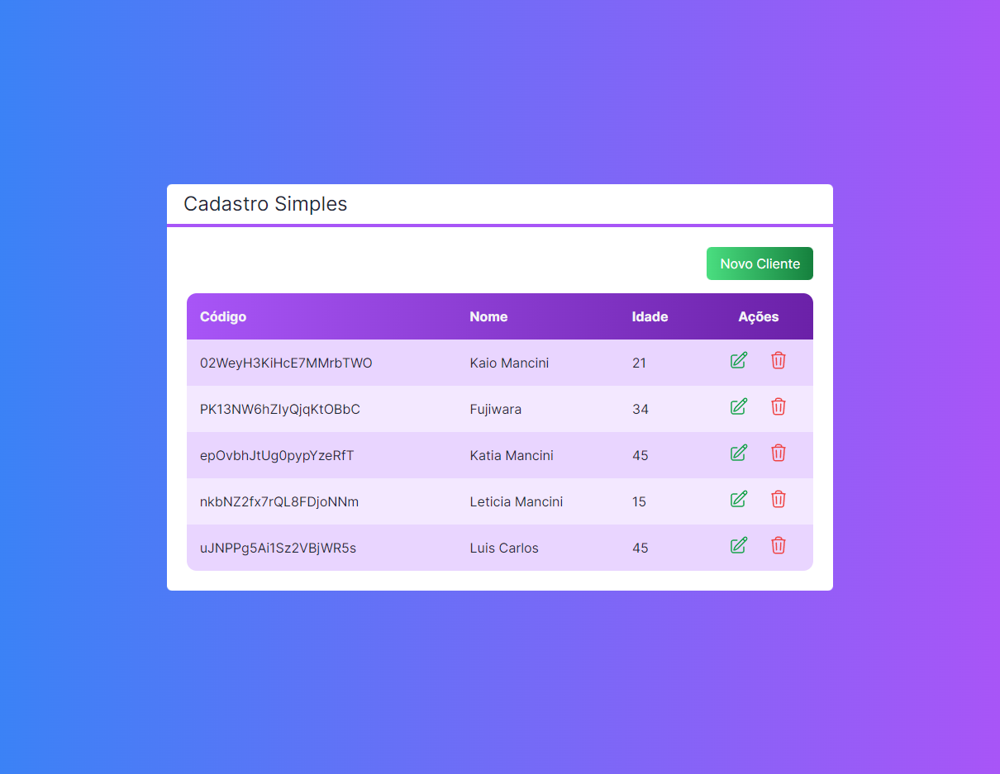

  

## 💻 Projeto
Esse é um projeto Web, na qual criamos um banco de dados utilizando o firebase, aplicamos nossos conhecimentos em React, utilizamos os Hooks, e demos o primeiro passo utilizando o Next.js, e aprimorando nossos conhecimentos em Tailwind.

## 🚀 Tecnologias
Esse projeto foi desenvolvido utilizando as seguintes tecnologias.
- HTML
- CSS
- Tailwind
- JavaScript
- TypeScript
- React / Next.js
- Git e GitHub

